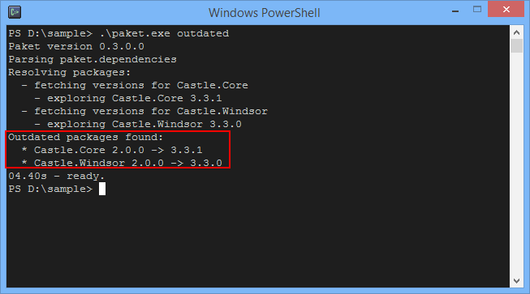

- title : Paket
- description : Introduction to Paket
- author : Max Grebeniuk (forked from Steffen Forkmann & tpluscode)
- theme : league
- transition : zoom

***

### What is Paket?

- Dependency manager for all .NET and Mono projects
- Plays well with NuGet packages and [nuget.org](http://www.nuget.org)
- Allows to reference source code files from HTTP sources and GitHub

  
 

***

### Why another package manager?

- .NET ecosystem has already NuGet
- Integrated in Visual Studio and Xamarin Studio
- [nuget.org](https://www.nuget.org/) is etablished package feed
- _I'm in love with Nuget, changes are always for bad. #BABYRAGE!_

 
 

*** 

### Nuget issues
#### So what's wrong with Nuget anyway?

****

#### Nuget issues

- NuGet has no global view of your dependencies
- `packages.config` files are spread over all project folders
- Try to verify consistency of packages in _SocialCee solution_:

 
 
 

---

#### Nuget issues
    
- Multiple versions of same package in solution
- Each `package.config` contains all references

---

#### Nuget issues
    
- NuGet has no concept of transitive dependencies
- Which packages do we really need?

 

---

#### Nuget issues
    
- By default installs oldest matching version
- And lowest required version of transitive dependency if not referenced

 

***

#### Nuget issues (fsharp)

- NuGet puts the package version in the path
- Updates require manual work (at least if you use .fsx):

    #I "packages/Deedle.1.0.1/lib/net40"
    #I "packages/Deedle.RPlugin.1.0.1/lib/net40"
    #I "packages/FSharp.Charting.0.90.6/lib/net40"
    #I "packages/FSharp.Data.2.0.9/lib/net40"
    #I "packages/MathNet.Numerics.3.0.0/lib/net40"
    #I "packages/MathNet.Numerics.FSharp.3.0.0/lib/net40"
    #I "packages/RProvider.1.0.13/lib/net40"
    #I "packages/R.NET.Community.1.5.15/lib/net40"
    #I "packages/R.NET.Community.FSharp.0.1.8/lib/net40"

---

#### Nuget issues

- NuGet doesn't allow to reference plain source files (C# Roslyn and F#) 
- If you want to reuse code you have to create a package

***

### Paket intro

http://fsprojects.github.io/Paket

- F# Community Project
- Very active (> 6100 commits by now)
- immediate fixes to bugs

---

### Paket - Project Principles

- Integrate well into the existing NuGet ecosystem
- Make things work with minimal tooling (plain text files)
- Make it work on all platforms
- Automate everything
- Create a nice community

 

***

### Paket file structure

- `paket.dependencies`: Global definition of dependencies
- `paket.lock`: List of used versions for all dependencies
- `paket.references`: Dependency definition per project

  
 

***

### paket.dependencies

- Specifies all direct dependencies
- Manually editable (or via paket.exe commands)

    [lang=paket]
    source https://nuget.org/api/v2
           
    nuget Newtonsoft.Json   // any version
    nuget UnionArgParser >= 0.7 // x >= 0.7
    nuget log4net ~> 1.2    // 1.2 <= x < 2     
    nuget NUnit prerelease  // any version incl. prereleases
    nuget EntityFramework framework: >= net45   // target framework, any stable version
    nuget Facebook 7.0.6    // all frameworks, version pinned to 7.0.6
    

---

### paket.lock

- Graph of used versions for all dependencies
- Compareable to a unified view of all `packages.config`
- Automatically computed from `paket.dependencies`:

    [lang=paket]
    NUGET
        remote: https://www.nuget.org/api/v2
        specs: 
            Autofac (3.5.2)
            Autofac.Extras.DynamicProxy2 (3.0.7) - framework: >= net45
                Autofac (>= 3.3.1 < 4.0.0)
                Castle.Core (>= 3.2.2)
            Autofac.Extras.FakeItEasy (3.0.3) - framework: >= net45
                Autofac (>= 3.3.1 < 4.0.0)
            FakeItEasy (>= 1.18.0 < 2.0.0)
                Autofac.Owin (3.1.0) - framework: >= net45
                Autofac (>= 3.5.0 < 4.0.0)
            Microsoft.Owin (>= 3.0.0 < 4.0.0)
                Autofac.Web (4.0.0) - framework: >= net45
                Autofac (>= 3.4.0 < 5.0.0)

---

### paket.references

- Specifies which dependencies are used in a given project
- Compareable to `packages.config`, but without versions
- Only direct dependencies need to  be listed
- Manually editable

    [lang=paket]
    AutofacPake
    Autofac.Extras.DynamicProxy2
    Autofac.Web
    Autofac.WebApi2
    Castle.Core
    NUnit

***

### Basic commands HowTo

 
 
---

### Installing packages

    $ paket install

- Computes `paket.lock` based on `paket.dependencies`
- Restores all direct and transitive dependencies
- Processes all projects and adds references to the libraries

---

### Checking for updates

    $ paket outdated

- Lists all dependencies that have newer versions available:

  
 

---

### Updating packages

    $ paket update

- Recomputes `paket.lock` based on `paket.dependencies`
- Updates all versions to the latest matching all restrictions 
- Runs `paket install`

---

### Restoring packages

    $ paket restore

- Restores all direct and indirect dependencies
- Will not change `paket.lock` file
- Can be used for CI build or from inside Visual Studio

---

### Convert from NuGet

    $ paket convert-from-nuget

- Finds all `packages.config` files
  - Converts them to `paket.references` files
  - Generates `paket.dependencies` file
  - Computes `paket.lock` file
- Visual Studio package restore process will be converted
- Runs `paket install`

---

### Simplify dependencies

    $ paket simplify

- Computes transitive dependencies from `paket.lock` file  
  - Removes these from `paket.dependencies`
  - Removes these `paket.references`
- Especially useful after conversion from NuGet ([Sample](http://fsprojects.github.io/Paket/paket-simplify.html#Sample))

***

### Bootstrapping

- Don't commit `paket.exe` to your repository
- Bootstrapper is available for [download](https://github.com/fsprojects/Paket/releases/latest)
- Bootstrapper allows to download latest `paket.exe`
- Can be used for CI build or from inside Visual Studio

***

### Source code dependencies

- Allow to reference plain source code files
- Available for: 
  - [GitHub](https://www.github.com)
  - [GitHub gists](https://gist.github.com/)
  - HTTP resources
  
---

### Source code dependencies
#### GitHub sample (1)

- Add dependency to the `paket.dependencies` file 

    [lang=paket]
    github forki/FsUnit FsUnit.fs
    
- Also add a file reference to a `paket.references` file 

    [lang=paket]
    File:FsUnit.fs

---

### Source code dependencies 
#### GitHub sample (2)

- `paket install` will add a new section to `paket.lock`:

    [lang=paket]
    GITHUB
      remote: forki/FsUnit
      specs:
        FsUnit.fs (7623fc13439f0e60bd05c1ed3b5f6dcb937fe468)

- `paket install` will also add a reference to the project:

  

***

### Source code dependencies 
#### Use case - "Type Provider definition"

- For F# Type Providers you need a couple of helper files
- It was painful to keep these up-to-date
- Reference F# Type Provider files in `paket.dependencies`:

    
    [lang=fsharp]
    let sum x y = x + y 

- Add the files to the Type Provider's `paket.references`:

       
***

### Dependency Groups

- Allow for better organization of dependencies
- Enable easier conflict resolution

    [lang=paket]
    source https://nuget.org/api/v2
    
    nuget Newtonsoft.Json    
    github forki/FsUnit FsUnit.fs
    
    group Build
        source https://nuget.org/api/v2
        nuget FAKE    
        github fsharp/FAKE modules/Octokit/Octokit.fsx
    
    group Test
        source https://nuget.org/api/v2
        nuget NUnit
        nuget NUnit.Runners ~> 2

---

### Dependency Groups (paket.lock)

    [lang=paket]
    NUGET
      remote: https://nuget.org/api/v2
      specs:
        Newtonsoft.Json (7.0.1)
    GITHUB
      remote: forki/FsUnit
      specs:
        FsUnit.fs (81d27fd09575a32c4ed52eadb2eeac5f365b8348)
    GROUP Build
    NUGET
      remote: https://nuget.org/api/v2
      specs:
        FAKE (4.3.1)
        ...
    GROUP Test
    NUGET
      remote: https://nuget.org/api/v2
      specs:
        NUnit (2.6.4)
        NUnit.Runners (2.6.4)

***

### Getting help

    $ paket [command] --help

- Visit the [online documentation](http://fsprojects.github.io/Paket/)
- Create a [GitHub issue](https://github.com/fsprojects/Paket/issues)
- Follow [PaketManager](https://twitter.com/PaketManager) on Twitter

***

### Paket.VisualStudio

- https://visualstudiogallery.msdn.microsoft.com/ce104917-e8b3-4365-9490-8432c6e75c36

 
<img style="border: none" src="data:image/jpeg;base64,/9j/4AAQSkZJRgABAQAAAQABAAD/2wCEAAkGBwgHBgkIBwgKCgkLDRYPDQwMDRsUFRAWIB0iIiAdHx8kKDQsJCYxJx8fLT0tMTU3Ojo6Iys/RD84QzQ5OjcBCgoKDQwNGg8PGjclHyU3Nzc3Nzc3Nzc3Nzc3Nzc3Nzc3Nzc3Nzc3Nzc3Nzc3Nzc3Nzc3Nzc3Nzc3Nzc3Nzc3N//AABEIAHwAugMBEQACEQEDEQH/xAAbAAEAAgMBAQAAAAAAAAAAAAAABQYCAwQBB//EADkQAAEDAwMCBQMCAgoDAQAAAAEAAgMEBRESITEGQRMiUWFxFDKBkaGx8AcjJDNCQ1JiwdEWkuEV/8QAGwEBAAMBAQEBAAAAAAAAAAAAAAIDBAEFBwb/xAAzEQACAgEDAQQJAwUBAQAAAAAAAQIDEQQSITETQVFhBSJxgZGhsdHwFDLBI1Ji4fFCM//aAAwDAQACEQMRAD8A+IKRIIAgCAIAgCAIAgCAIAgCAIAgCAIAgCAIAgCAIAgCAIAgCAIAgCAIAgCAIAgCAIAgCAIAgCAIAgCAIAgCAIAgCAIAgCAIAgCAIAgCAIAgCAIAgCAIAgCAIAgCAIAgCA8XAboaeSYgMHJwuOSRJQbMfCcBk7b4Tcd7NnhYQmQ4NHmD2BPwu5I4YyNIGNxyfVdOHiAIAgCHAgCABAZGNwaHEbFd2vGTm5ZwYrh0IdCAIAgCAmf/ABm5x0YramGOmpS3V4ssjRj8ZyT7Yys36uvdsjyzStLY4qT4RFwQPnmZHENT3nS0epWiT2rJRXHfLajW5pBIONj6oRNsNNJIQA3n3UJTSNFWnnY+ETMtG2Km8MUrHuxn6hozt6Y4/nlZY2bnnPuPTs0sK1tcff4nbbW2yOgfFNFUuqHOa8OaGgNxnIz6HI7dlVbO3dmLWCyrTV4w0bJ+mqoSanMeGPAdG5+5LO3GxU4XqSyimenUWREtH4Op07SNyGNOxKsVmehyWnSWZGRkjbSSsj0+GxhOHBpw47fdz3Ta3JN9RJxhXLauEvLq/MhnsdtgZzxjutWTyMYPNDs6SCCu5Dize6kezAkLQXceYfvvt+VGMlJ4RKdbgsyNLmODiCNwpvgrPNLvQoDspJPDgd9owcOOATpPbf4VsHwymyOZL85RgI45XlsWx7DOdQ/7RQT6HdzSyyRpbDVVTGGGJznvwAwDzE57K9aaTjuMs9bCMtuTrkht9JHUUtbHUOqdAZrbpeGuyCTjIx37lT2wgnGSeStTtsanW1t6+36kTTxDW7+zeM07AuOAPQ5Czwh5ZNdk/CWDmqad0Upbs4ereFXKDiy2FiksmjBCrLDN8MkbI3vbgSDLD6jOP4gqTWCKkm2l3HfbbLW3Rhdb2Rzub90Yka17ffBIyPcZU4VSs/byVW6iFX/04XyOZ1vrGOLXU0uQcHyp2Nngd/UVf3I+oVHSdurp6Ssp6+FlO3LZxKHvL99sA8Z34X5aGtnVCUJLnuxwfr7NPN2J7f5O+ltVkss7qyzMpJKnBGXzOLm52OA4eUfqflUTu1OoShY8L2E69HCEnPs3l/niQlt6ejp6yonnp7ZUNmGqSME/1GTwwY/4BWu7USnBRU2sdPP2kadDCuW5xzn5HZHY7RHVfT+JJG44eRGRj9CCcDnGVWr7ZQ3SeTS6tr/px/Pid9PDbG00xnqjUscA12Ig0xjORsCRx6KCtlGXC6kp1WWNRwk15nW3p+2QiOT6uIS5ywPb24GfdUPVSlw4vBQpWZaUOhnRTA08prqinmhp8xPbO0tDQDnALQCOeQrXNqS2rqcaTWVxLx/GZsjtkEFRPRChD2s/zHGRu3y3cfooSlY7Flv6HcKSSmuPd9zgkdfrzSMEVwpjE4ah9K2MBoG4y3BJ/CszXVPlP35HZUbXhv8APaUi6WiugqnTTQ+MHM81WwHAHx2IyB6L06tTXKOE8eRiemcZ525b7/xlafSuLwHys1E+vC9BSSR48oOUuWaZYzGcNfrdwdPACmnlFElteMmGDK7U94JO5JKmo+BCVjb55JSgt1XUtYyClM4D9yDs09t/wVqhVKWElkxXX1wy5SwX60UXUNtayaG5ReG/y63hgj242cMnfON1uhTLGJPJ5FuoqfSOPr9vkSNHUxXa3zyXeW1yvZJgvp26C4j10jc/kfCnVGMVlcldzluSWV7TcJ6OGllfaJaODwCHvkjc6WTI35c3b4A3Uk+Hu/0QlxKO1c+JyU9mobiyJ9wuMAnkblp0YLs7tzsOdtk5cV6uRu2SajLCNT6G00rKilbPocxzXSzOj2aRvgb/AApqKSfcQdk3KLXOSLq7ZaCxkk1XNM6Q6XOw2NrvfAB/XKpdabzI1wvmo7a108cmm5dPUzqP6WmhoYow7z1Uj3B4Ptnnb3wl2ni47Ixx5kdPrJ73OU2/8e4kKS30lVa6e2XiO3eFS50SNkLM7jJBAyCds8hFTCVeycfgcldbC921TfPc/oaH9F2aW4001DcadtFF5pYnCQP9vNzufj2ConpMuO1cIvj6QkoSVjy308DwUFixtcZAOw8+37rTsj5/Eo7a/vx8EW5nTM0MPhGMExHyyDfbc8ZXyh66Mnuz1Pry1tWVg8l6RlkLXxytjl/zC9g/GN0j6Risprj88iK9IQT5R30FgMLY2TVcTgCXO0jOD6bKm3WOTeIkLNcnlxizub01baqcVD8zA7Z1YBA7fCqetvhHangyy19sVtxg2GzW2d7qRkLIYyCXuazDj8ZUYai1SUptsitXfWu0zl/IjrqbdHTtdI7VFC1pBdtr7cn49Oy1VRu34j3l1c7Y897K5LebcGEVDdXn1MYwjUCSvRWmuz6rLcTTzk6bNPa5qmQVMHhxvI80p1a3EHYjtgKrURvjFOLy0dm7XF7XyTFT05BQSsq7U8NJGfLnTjIzsPhZ4a6c/Ut5Mldym2pRwyRqYSbW6Zw8WPQC90fl34OR+f2Ua9s5vb1OQn/V29/mfH7xYom1VRJR1EL4o3ZJDhqHHI/6X63TTnKtSn1MWqUVPbWiGqo3RQAQvDnF2DjYe/5WyB5V0uRR2l9S18zpYQ0fcSQ0N/Hf8LbXQpLOTzbtVseMM+v9FUEbbb4NAzxI4wC+YnyHJycjuMA8+vyvRlsqSWTwP6l85Nrn6HktjkvleIp5vEpmv0sLAWDv2Gx5KlOUVD1iFbluxDr0ycXUVNYrRAaOjjjncweZjPKXNJG+R6bcLkZPb0xkntk7P3N47yEgvFricYwx8U4boDpCCMEEJ2i6Pgm6LMblyTdhqKCoJma3EsYa17Oc52yAOB7+/wAqe/PCM86nHmXQsT7Pa4wK6PFQyplIkbOwnBGft2yqo2T5gyyyEMRsTyKjo+0VAjmhhfEdOrDXYO3Gxyoq5p8os7L1fVkcVZYIJMOo66MNwQXObgj39MrSr3j1kYnQk/Vlkhh0VM+UPqKmF8Az/dtDicZxjdVucXyalZNJ4XzNg6YqWF58DxJI9m5GkA55537bfKt3w45KM2eBqb/R9KWgl0ecepVX9E0drf4Ha2419UIS4ujIDS4A42JI3+cH8ZXyv9PTDOOT7Iqqo54Ns9xrC52QdIJ7HT6/wx+6jHTVnI0VJGukucksjvFGGAZIYDg/gKdunSXByVSS46kzBdJpi4U8ErmNbkP8EjjssUtLFcyfzMktPCP7n8yIi6kuUFc9nhEkAhvieUOOOPgdz6Arb+hqcU8ltmlocMJEbdbxZI4zT3e5fU7HVFRjUdROTjIIGPkd8+i2U6a5y3QWF5lc9Qq/2x9boVkVlgY6T/8APpblUyPOfEqIWOe343cP2W9w1H/prHvIQcZdU8+9k9R2a73DP07pJ2yNzolcWAdtwQNvwsvbVRePpyW2W9ly+PceXquu/SE1JHcJYahlRATGInOcBp23yB6rkNJTqU3FYKXqqp8OJZuk6uG40clRGGCnqGa6mAO1eE8bHI7bfxXn6iLonsl1XR+Ry1qSTX7u4pHXdvt1ux9GyOISZwHnJODvnJz+f4r1vR2ottzueUV21VqtOXD8+h83neS8nAGeADnC92J4Fi5J/pOOCsr44KkRuD8eQnd2Odz7dl6Ok2SliR4+vc663KHcfYX0dLRdO/TW1zaWkeQ2pkcS3Ddycknv/PK2qMVL1+7oeM7LJLMer4ZRaXqWsvd2pbLZmRUzpqjw4HFxDQBnBJG++OwVEtXzjBuj6OwszefuyQuHS3UFI97p3t0yS+aoppjodntg4ORhST39OpXKUa8eHn4+0rVXVW+N8lPeqWrlccA1DadutvwToP6lVWbI/vT+n2NNXayWaml78/cl7Hd+lqRrRb66vpZtWHOrfLrb7FoOB7ahx3VlOoqi8Mo1ek1M1u4fsJ+o6kuNJQ09LSyQ1UbCfDkp9xI3sQM8juPcequSipOTWWzNs3RUd2EvH+f4JeG8V7KCKolhmeHjBf4JyBzlT2QZncp5I25XbIdJTh2pzsEGMsBO/II/huprggotvk54LtVkCWIED0jHGBuPnB/b3XeGuTrrUXwzbJX17KiGXXhoDMtycBxOM4P4/Zc4x0JJJvqRcnUd1Ejh4Lxuds5x+yb/APEl+nr/ALy4wwW2OIvFQypfGNTmwuG3J/5Xyl13yxhYT8fz6n1h6mcnhLBXrzezDWPio6BjI4oi/XIS/OG6nDSNs/P/ACvQq9H+punPq8GeesnCW1895R6rrW8Tu8KGoiaCOYGhn78r0I+jdPDlrJnjq7ZvCN1g6zmppgLnWVEjXeXW5xIYD+/6KvVejlOOa4pF2n1lMcq1tmM9bUsiqy6+297HDIDqlzhIdgTpxqaSFZGmD2+o/gv+Fa1brlLbJc9PD7oj4o4K+MmifmZoJkhHp6t9R+4Vk90H63Q11W13LCfP1MqSPRPh4LQDghp3+AVyTyuCyPEsdD6P0rUiN4hoXPgD2lvmfrDiRtjPJ9hsvD1Wc5lz7uTTbTFV7pc45NnVVif9DJPVRzVsobmma4glp5Li0ZySf8Poml1KU9sXhd76FFdld2Y4SwRnR7vDE7mUs1E+OnkBMsRAeTsCcjBKs1qz1e7LXeWpQlBQS70VLqeprrjTsqKmGRrGudpmc3S0hx2DfXjtn1Xr6SquvOw8rXWt8LoU57tm+UD1PqvRR48yU6cFU2ubPSQSTSRebTGMkbEZAG5xztwtVEnGWTDqodpXtbPoMtZNW9IQSVrH1EkVS7VAyIk/bp8wGe47r00/V3Ndx4Mo4tcIPHPX+cnP0VZHV8kj4aKairGvBp6hwMejb7dxkjkauRsqq4wjFzax5GjUTm5RrjLOevf+ffnvLP1G6pttvZQ1E88sWSfCIAfpG2NictBzuOMLRBwnmSXwMUoyg1HPxPld3bC6d30rXMZ/oe8yfoeVhu/dwe3p3Lb63U5IqNkcf1FW7wafOOM6zzgBVbUlmXQtdjb2w5Z20FTIaWVtHcKWlYTgwuqDG4gjfJIxuMfauKx7Wk0vz86ELK1vTnFvzxx+e0767qmWlt0VFBcZJapmXGankdoaT2BO52xwtE9TGNainl+Jlp0Lna7GsR8H/ojKTq+9UxH9ufI1x38UB+/rh2VnWqsXVmyfo+iXSOC1Wnqiqlghq5qOmqB4jmf1eYyMYJ3G2wd3/C213TlFNHmXaSqFjj0Lw0WepY6WTVRtjd90jxp7HG3bvwr3KcVzyYFCLeFlHIbdSNOll3tpaNgXPbnHvuuduvAs/T2HxuzXiehukNS+aTw2kiRudQc05BBB5G5X5u2rdW4xXJ+0qucbFKT4LhcurLTVUUsFPPPA57TgMiLWn274Xn1aS5NKa4XmehPW0tPb1KFG1hnJjJAAzwvUllI86qCnPKeMc/AykdH2Li7OediuJMtlKvuzn5P88DySlf4IlaMtJxkOzvjOP0RSWdpGdMnFSS+feaI5HROD2OLXtOQ4HBBU2kzMm08otdjvFtqG+FeWmKYDMczSdDz/ALwOD7jb1wvO1OntXNPw+x7Oi9Ix3KOo6eP3LjS1UzaOU24NiaW/1dVFIJHY9NvtHwvInFRkt/Xw6f8AT9FW69Q8KSaXcuhLU/VuaSq8elgp6mOne6OZrW/fsNQztnfusq0LjZFxllZ6PwMmp0irSe54ys+wgLv/AEjV8ZNNLpkY5rSWxua3vuCRn3yvSq9GqaznBhtv01EsRjz7f+lavFzqbzX1VVEwNkDWuEYkPlHcDPYb9vwvT01XYwUM5PO1UlJ5XGEVSV+t7nOPJzj3W1I89nXSOlig+ozpEbgGnODn2+FfBuMd3cZrFGUtveXaH+ki4wVbhTMERk0NcS/U0kdyHDbPf+StT1MZPa4nnx9Hyityl8iyQ9aufbJ6isgp6yp+q0Rjw2bRlmcDT/hyM755Psr4bXJ4bwY7K5YSSS9xFvulwr2VEktPFLHI4eFSk+HHAMctd/h2H5VyTjFy+pU9jlGGenevsVu61dmp45JMPmrT9sTJPKD3L3DY99hufZY77ql+3l/I9DTU6iTxLiPz9xU6mpkqZNcp+AOGj0C8+UnJ5Z60IRgsIwjidJnSOAST6ALi5OuSXU82DsO49l0c9wdvpOcjsuBFp6ZvdFbKZzKmeoALv7pjcj5W/TaiuqOJNnla7SXXSzFL2nL1JfG174I6F7mU8QzpazQNW2+O58oVWq1HaNbehdoNG6YvtOW/eQv1Un+p3/sVm3S8TdsRoXCYyVwHZC+mhY1+A6bHfOG//VXJTfsNdVlNaUsZl8jlkIEmWHI7FTXTkzSaUvVDpHu+5xPyUSwJTlLqzFSInuT6ocM4JpaeQS08r4pBw5jsFRlFSWJLJKMnF5XBIVF8r66FsNdVvlY06m5AGHDg7cqqGnrr5hHBfLVXTWJybNtPVPqYJKeQ642eYazjzcdlJVxi8pEZXzmsN8EPqcDs4jtsrCrJ4unBk7b8cIcO2mmdBTvkjOHHLHHvpPI9FbF4hkpnHdJJnlNcKmjmM9NO9krhgnAO3OMH3XFZKLzF8nZUwnHbJcGusrqqtfqqp3yn/cdv0UZzlN5k8na6a6liCwc6iWhAegkcEhDh4STyUBtYYywNeAMcOHK7ldGRaa5RqXCQQ6EAQBAEAQBAEAQBAEBtp3tbMDI3LTsfhAajycHPuhwIdA90Bm9zdDQBvuXH3TuwRSecmCHQh0IAgCAIAgCAIAgCAIAgCAIAgCAIAgCHAh0IAgC4AugIAgCAIAgCAIAgCAIAgCAIAgCAIAgCAIAgCAIAgCAIAgCAIAgCAIAgCAIAgCAIAgCAIAgCAIAgCAIAgCAIAgCAIAgCAIAgCAIAgCAIAgCAIAgCAIAgCAIAgCAIAgCAIAgCAIAgCA//2Q==" alt="Paket.VisualStudio" /> 

***

### Thank you

- Take a look at https://github.com/fsprojects/Paket
- Slides based on [PaketIntro](https://github.com/forki/PaketIntro) & [FsReveal](http://fsprojects.github.io/FsReveal/)
